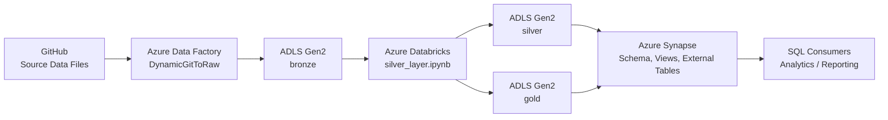

# Architecture Diagram Source

Use this Mermaid diagram directly in GitHub or as a reference when recreating the architecture in draw.io or Excalidraw.

```mermaid
flowchart LR
    GH[GitHub\nSource Data Files] --> ADF[Azure Data Factory\nDynamicGitToRaw]
    ADF --> B[ADLS Gen2\nbronze]
    B --> DB[Azure Databricks\nsilver_layer.ipynb]
    DB --> S[ADLS Gen2\nsilver]
    DB --> G[ADLS Gen2\ngold]
    S --> SYN[Azure Synapse\nSchema, Views, External Tables]
    G --> SYN
    SYN --> C[SQL Consumers\nAnalytics / Reporting]
```
